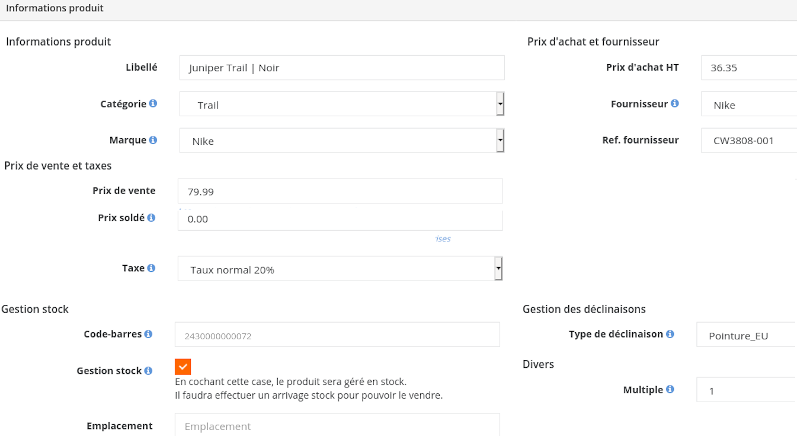

Gestion des produits et des stocks dans Hiboutik
=====================================================

.. note::
   L’objetcif de ce document est de décrire une méthode uniformisée de
   gestion des produits dans le logiciel afin de pouvoir faciliter la
   synchronisation des données et de permettre une gestion rigoureuse des
   stocks.

Prérequis
------------

Il est nécessaire de souscrire un abonnement Premium à Hiboutik
(12.90€/mois) pour assurer la synchronisation des données entre votre
logiciel et *La Solution Running*.

Pour souscrire, rendez vous sur votre caisse Hiboutik, puis cliquez sur
``Abonnement``, entrez votre numéro de TVA intracommunautaire, ajoutez
l’option «premium» et validez le paiement.

Préambule
-----------

La solution running utilise les données de votre logiciel de caisse
pour nourrir votre commerce en ligne de façon complètement automatique.
Ce transfert de donnée et son bon affichage sur votre site néssécite que les
données de votre logiciel de caisse soit parfaitement structurée. Afin d'éviter
les erreurs de frappes dans les noms de produits n'hésitez pas à
consulter nos données préremplies ou à nous consulter en cas de besoin.

Entrée des marques et fournisseurs.
--------------------------------------

Les manipulations se feront dans l’onglet ``Produits`` → ``Paramètre produits``.

Choisissez dans le menu déroulant ``Marque`` puis ``Fournisseurs`` (vos distributeurs), entrez
les noms des marques et fournisseurs susceptibles d’être liés à vos
produits. Ces deux éléments peuvent êtres identique.

Vous disposez d’une liste préexistante de marques, n'hésitez pas à les ajouter par copié/collé :doc:`ici  <./data/marques>`.

La première lettre des marques doit êtres en capitale, les acronymes en majuscule. Exemple «BV Sport», «X-Bionic», «2XU» etc…

Création des catégories
--------------------------

Dans le menu ``Produits`` → ``Paramètre produits`` → ``Catégories``.

Créez les catégories telles que définies :ref:`dans ce document <categories-de-produits>` en respectant  l’arborescence.

Pour ce faire:

 - Cliquez sur l’Icône |image0a|
 - Créez les catégories de 1er niveau (Homme, Femme, Accessoires, Bagagerie/hydratation etc…).
 - Cliquez ensuite sur «Homme» et créez les catégories de second niveau (Chaussures, Vêtements).
 - Cliquez ensuite sur «Chaussures» et créez les catégories de 3 eme niveau (Running, Trail etc…).
 - Enfin revenez en arrière en cliquant sur la flèche jusqu’a afficher «Vêtements», cliguez dessus  et créez Haut, Bas etc…

 Et ainsi de suite jusqu’à créer l’arborescence complète.

Déclinaisons
----------------

Dans le menu ``Produits`` → ``Paramètre produits`` → ``Déclinaisons``.

Pour éviter les confusions, nous vous conseillons de modifier et renommer les
déclinaisons déjà présentes dans Hiboutik en cliquant sur le
boutton |image0|\ : de la déclinaison, puis de modifier ses «types» en cliquant
sur |image1a|.

.. warning::
   Le *libellé* de chaque déclinaison doit être rigoureusement identique à ceux dans la liste ci-dessous.

Les déclinaisons nécessaires pour la Solution sont:

- :doc:`Pointure_EU  <./data/pointures_eu>`

- :doc:`Taille_Vêtements  <./data/taille_vetements>`

- :doc:`Taille_Soutien Gorge  <./data/taille_soutiens_gorge>`

- :doc:`Volume  <./data/volumes>`

- :doc:`Taille_Bâton  <./data/taille_batons>`

Il n’est pas obligatoire d’entrer toutes les déclinaisons possibles
lors de la création de ces fiches: il reste possible d’en ajouter plus
tard, mais nous vous conseillons d’être le plus complet possible pour ne
pas avoir à faire de fastidieux allers et retours lors de l’entrée de
nouveaux produits.

Ajouter un produit
^^^^^^^^^^^^^^^^^^^^

Pour ajouter un produit, rendez vous dans le menu de gauche cliquez sur:
``Produits`` → ``Créer un produit`` dans le menu de droite.

Les champs qui nous sont indispensables sont marqué d’une étoile «*».

- **Libellé** \*: Nom de la référence seule, sans la marque. Si le
  produit comporte une couleur, alors, elle est ajouté à la suite du nom
  séparée par  un slash: « / » (le caractère s’obtient par les touches ``[Shift]`` +
  ``[3]`` sous Wndows, sous Mac ``[Alt]`` + ``[Maj]`` + ``[L]`` )
  Si le produit comporte plusieurs couleurs, alors elles sont séparées par un «-» et
  classées dans l'ordre décrit par la fiche fournisseur.

- **Catégorie** \*

- **Marque** \*

- **Prix de vente** \*

- **Code barre**: Hiboutik génère un code barre lors de la création du
  produit, ce code doit être remplacé par l’EAN du produit de sorte que
  chaque produit physique soit associé à l’EAN du fabricant sur son
  étiquette. N'hésitez pas à utiliser la douchette après avoir cliqué
  sur le champ pour le remplir si vous disposez d'étiquettes produit comportant l'EAN.

- **Gestion stock**\ \*: Cocher oui

- **Type de déclinaison**: (facultatif) à choisir si le produit comporte
  une taille, un volume, une pointure…

- **Prix d'achat HT**: (facultatif) avec ou sans la remise selon votre préférence (sert pour vos statistiques).

Enfin, sauvegardez la fiche en cliquant sur le boutton en bas à droite.

.. warning::
   En ce qui concerne le code barre: si un produit comporte des déclinaisons, ce sont elles dont
   l’étiquette correspondra à l’EAN du fabricant. Dans ce cas, la fiche
   produit servant de base pourra conserver l’EAN attribué par Hiboutik
   puisque elle ne sera collée sur aucun produit.

Exemple de la création d’un produit à déclinaison
^^^^^^^^^^^^^^^^^^^^^^^^^^^^^^^^^^^^^^^^^^^^^^^^^^^

Nous créons ici un produit pour la chaussure de trail de Nike «Juniper
Trail» dont voici la fiche Hiboutik complétée:

|image1|

Ce produit comporte des déclinaisons («Pointures_EU»),
nous laissons donc le code barre par défaut.

Les EAN seront donc rentrés pour chaque pointure.

Ici nous avons reçu deux exemplaires en 40 et un exemplaire en 39.1/3
nous modifions donc les code barres correspondants dans l’onglet
``Déclinaison`` pour y mettre l’EAN de chacune de ces références.

Les étiquettes qui ne seront pas imprimées peuvent conserver
le code barre par défaut de Hiboutik.

|image2|

Exemple de la création d’un produit simple
^^^^^^^^^^^^^^^^^^^^^^^^^^^^^^^^^^^^^^^^^^^

Il s’agit de lunettes dont nous avons reçu deux types de paires: Jaune
et Noires.

Nous entrons l’EAN diretcement dans le code barre de la fiche produit:

|image3|

|image4|

Le code barre s’est mis à jour automatiquement. Nous créerons une
deuxième fiche pour la paire Noire et entrerons son code barre de la
même manière.

Arrivage de stock
------------------

Les arrivages permettent de créer et mettre à jour le stock de chaque
produit.

Les produits disponibles pour chaque arrivage sont uniquement ceux du
fournisseur choisi lors de la création de l’arrivage.

Nous vous conseillons de créer le code barre EAN de chaque produit avant
de l’entrer dans le stock ainsi vous n’aurez plus qu’a entrer son
EAN dans «Code barre», cliquer sur «Ajoutez», choisir une quantité puis
«Réceptionner» pour mettre à jour le stock de la quantité choisie.

Exemple : arrivage de stock pour un produit existant.
^^^^^^^^^^^^^^^^^^^^^^^^^^^^^^^^^^^^^^^^^^^^^^^^^^^^^^^

Comme dit plus haut, dans cet exemple, nous avons reçu deux exemplaires en 40 et un
exemplaire en 39.1/3 du modèle «Juniper Trail» de Nike.

Dans ``Produits`` → ``Arrivage de stock``

Nous créons un nouvel arrivage pour le fournisseur Nike.

Nous avons déjà modifié les code barres pour ces deux produits, il ne
nous reste qu’à entrer les quantités:

|image5|

|image6|

Cliquer sur «Réceptionner» les produits sont ajoutés aux stocks.

.. note::
    Astuce pour identifier les doublons de code barre: ``Produits`` → ``Paramètres de produits`` → ``Misc.`` → ``Identifier les
    doublons de codes barres``.

Synchronisation avec La Solution Running
-------------------------------------------

Une fois votre compte premium activé, rendez vous sur :

``Paramètres`` → ``Utilisateurs`` → ``API`` de votre compte.

Et copiez collez les quatre lignes (JSON API file, Email Address, API
key, Account) avant de nous les faire parvenir. Pour plus de sécurité,
pensez à supprimer ce mail de vos archives d’envoi après expédition.

